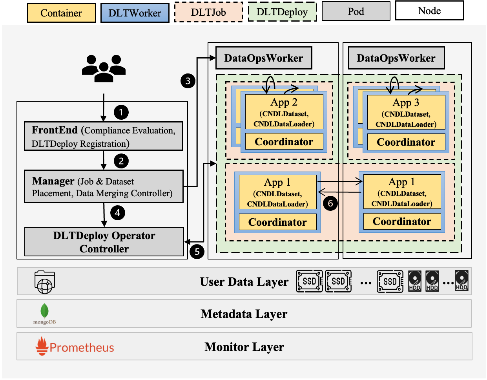

# CNDLSys
This repo is created for reproducibility and sharing of the codes used for the paper, Towards High-Performance Data Loading in Cloud-Native Deep Learning Systems, accepted by The 16th International Conference on COMmunication Systems and NETworkS (COMSNETS'24).

```latex
@inproceedings{kang2024cndlsys,
  title={Towards High-Performance Data Loading in Cloud-Native Deep Learning Systems},
  author={Kang, Zhuangwei and Min, Ziran and Zhou, Shuang and Barve D. Yogesh and Gokhale, Aniruddha},
  booktitle={The 16th International Conference on COMmunication Systems and NETworkS (COMSNETS'24)},
  year={2024},
  organization={IEEE}
}
```



This paper focuses on the critical role of data locality and data loading optimizations in the context of serverless Deep Learning (DL) platforms. With the rapid advancements in GPU computational capabilities, I/O bottlenecks at the CPU are increasingly leading to data stalls. To address this issue, we present a novel serverless DL platform, CNDLSys, which is equipped with a cooperative job schedule and data placement (CSP) strategy that ensures maximal local data retrievals for DL applications. Furthermore, we introduce a runtime-aware data merging technique along with an online data loading method to boost data loading throughput by efficiently eliminating I/O bottlenecks when reading a large number of small files.

The experimental results conducted on large-scale, real-world GPU cluster workload traces underscore the efficacy of our CSP strategy. CNDLSys significantly improves the local data hit rate by up to 16.5% compared to the Bin-packing algorithms-based methods. Moreover, its data merging and loading techniques show notable enhancements in throughput when the data and the DL application reside on the same node, achieving an improvement of up to 48.89% and 3.05% for the ImageNet and LibriSpeech datasets, respectively. In scenarios where data is located on remote nodes, our approach boosts throughput by as much as 62.41% and 8.91%, respectively, for the same datasets.
